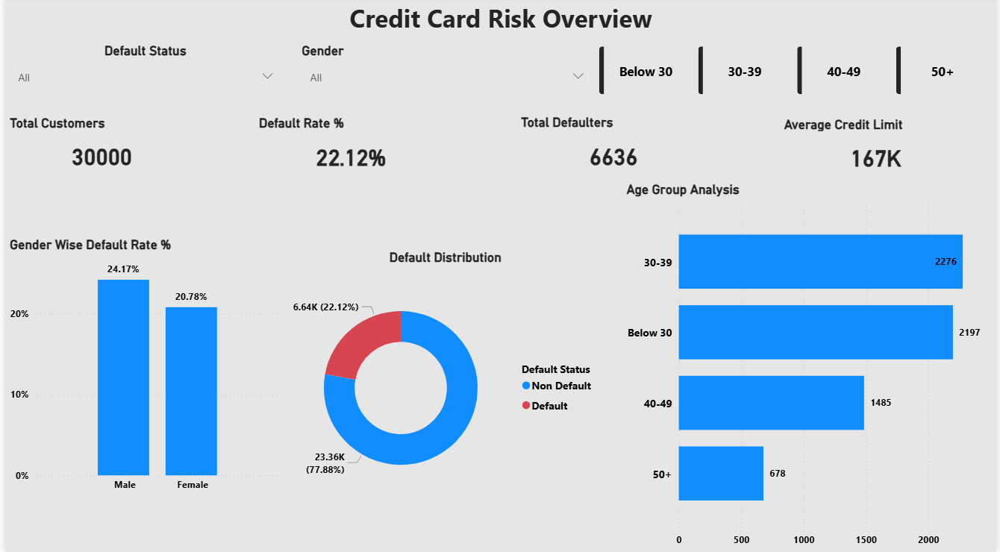
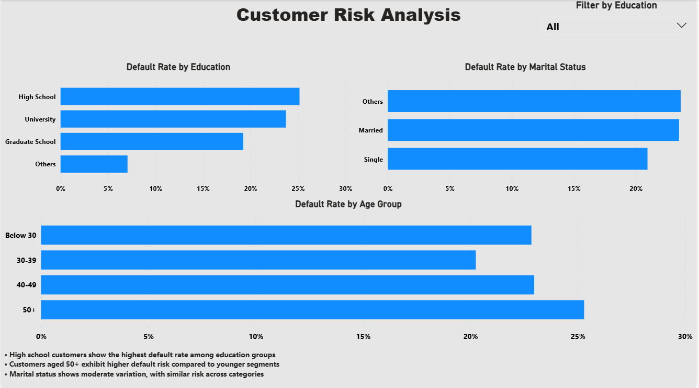
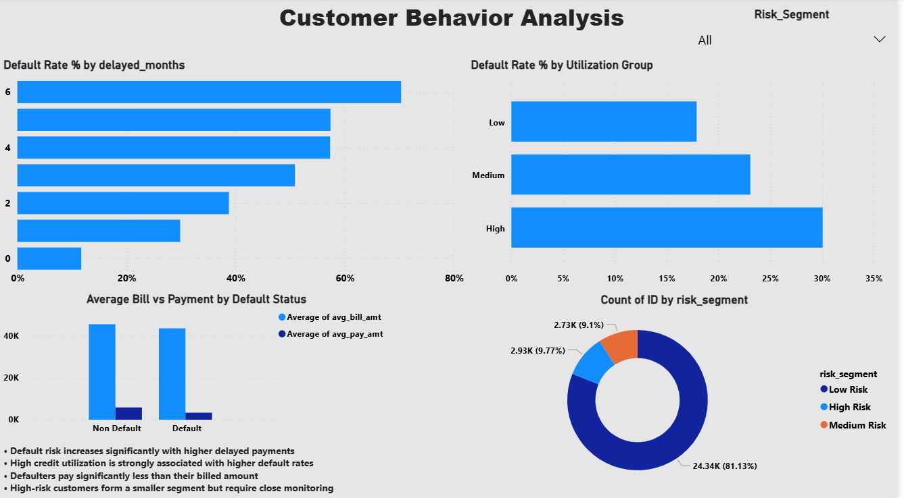

# 📊 Credit Card Financial Behavior & Risk Analysis

## 📌 Overview
This project analyzes credit card customer data to understand financial behavior and identify patterns associated with default risk. The analysis is performed on the UCI Credit Card dataset containing 30,000 customer records.

The objective is to explore how repayment behavior, credit utilization, and customer characteristics influence the likelihood of default.

---

## 🎯 Objective
- Identify high-risk customers based on financial behavior  
- Analyze repayment patterns and delays  
- Understand credit utilization trends  
- Perform customer segmentation for risk assessment  

---

## 🛠 Tools & Technologies
- SQL (MySQL)  
- MySQL Workbench  
- Power BI  

---

## 📂 Dataset
- Source: UCI Machine Learning Repository  
- Records: 30,000 customers  

### Key Features:
- Credit Limit (LIMIT_BAL)  
- Demographics (Gender, Education, Marital Status, Age)  
- Repayment History (PAY_0 to PAY_6)  
- Bill Amounts (BILL_AMT1 to BILL_AMT6)  
- Payment Amounts (PAY_AMT1 to PAY_AMT6)  
- Default Status (Next Month)  

---

## 🔧 Project Workflow

### 1. Data Import
- Created database and tables in MySQL  
- Imported dataset using SQL  

### 2. Data Cleaning
- Checked for duplicates and missing values  
- Validated and standardized categorical columns (Education, Marriage)  

### 3. Feature Engineering
Created new analytical features:
- Average Bill Amount  
- Average Payment Amount  
- Credit Utilization Ratio  
- Delayed Months Count  
- Maximum Repayment Delay  
- Age Groups  
- Risk Segmentation (Low, Medium, High)  

---

## 📊 SQL Analysis

Performed key analysis including:
- Overall default rate  
- Default rate by gender, education, marital status, and age group  
- Credit utilization impact on default  
- Payment vs bill comparison  
- Repayment delay analysis  
- Risk segmentation and high-risk customer identification  

---

## 📊 Dashboard

An interactive Power BI dashboard was built to visualize insights and enable better decision-making.

### Dashboard Includes:
- Risk Overview  
- Customer Risk Analysis  
- Customer Behavior Analysis  

### Screenshots:

#### 📌 Overview

#### 📌 Risk Analysis

#### 📌 Behavior Analysis

---

## 🔍 Key Insights
- Customers with higher repayment delays show significantly higher default risk  
- High credit utilization strongly correlates with increased default probability  
- Defaulters tend to pay significantly less than their billed amount  
- Behavioral factors are stronger predictors of default than demographic attributes  
- Risk segmentation helps identify and monitor high-risk customers effectively  

---

## 🚀 Project Outcome
This project demonstrates end-to-end data analysis using SQL and Power BI, including:
- Data cleaning and transformation  
- Feature engineering  
- Exploratory data analysis  
- Dashboard development  
- Business insight generation  

---

## 📌 Future Improvements
- Build predictive models using Python  
- Enhance segmentation using advanced analytics  
- Deploy dashboard for real-time monitoring  

---

## 💼 Author
**Sachin**  
Aspiring Data Analyst  
